mxnet 实现deepid,  参考的是mxnet 自己提供的symbol_xyz.py, xyz 代表具体的网络名字, 比如说alexnet, googlenet...

实现的deepid 的代码如下:

```python
import find_mxnet
import mxnet as mx

def get_symbol(num_classes = 530):
    input_data = mx.symbol.Variable(name="data")
    # stage 1
    conv1 = mx.symbol.Convolution(
        data=input_data, kernel=(4, 4), stride=(1, 1), num_filter=20)
    relu1 = mx.symbol.Activation(data=conv1, act_type="relu")
    pool1 = mx.symbol.Pooling(
        data=relu1, pool_type="max", kernel=(2, 2), stride=(2,2))
    
    # stage 2
    conv2 = mx.symbol.Convolution(
        data=pool1, kernel=(3, 3), stride=(1, 1), num_filter=40)
    relu2 = mx.symbol.Activation(data=conv2, act_type="relu")
    pool2 = mx.symbol.Pooling(data=relu2, kernel=(2, 2), stride=(1, 1), pool_type="max")
    
    # stage 3
    conv3 = mx.symbol.Convolution(
        data=pool2, kernel=(3, 3), pad=(1, 1), num_filter=60)
    relu3 = mx.symbol.Activation(data=conv3, act_type="relu")
    pool3 = mx.symbol.Pooling(data=relu3, kernel=(2, 2), stride=(2, 2), pool_type="max")


    conv4 = mx.symbol.Convolution(
        data=pool3, kernel=(2, 2), pad=(1, 1), num_filter=80)
    relu4 = mx.symbol.Activation(data=conv4, act_type="relu")

    # stage 4
    fc160_1 = mx.symbol.FullyConnected(data=relu4, num_hidden=160)
    fc160_2 = mx.symbol.FullyConnected(data=conv3, num_hidden=160)

    dropout = mx.symbol.Dropout(data=fc160_2, p=0.5)
    fc_class = mx.symbol.FullyConnected(data=dropout, num_hidden=530)
    # stage 6
    softmax = mx.symbol.SoftmaxOutput(data=fc_class, name='softmax')
    return softmax
```

我觉得虽然有了代码,  但是不够直观, 一图胜千言啊, 所以可视化还是很需要的.

http://josephpcohen.com/w/visualizing-cnn-architectures-side-by-side-with-mxnet/ 

```python
import find_mxnet
import mxnet as mx
import importlib

name = "inception-v3"
net = importlib.import_module("symbol_" + name).get_symbol(2)
a = mx.viz.plot_network(net, shape={"data":(1, 1, 299, 299)}, node_attrs={"shape":'rect',"fixedsize":'false'})
a.render(name)
```
刚才链接的博主, 自己还化了其他的很多图示. 大家可以看看, 因为图示太大了, 所以我就没有粘贴过来, 想要看的, 大家去他的网站吧.

```dot
digraph plot {
	convolution0 [label="Convolution\n4x4/1, 20" fillcolor="#fb8072" fixedsize=false height=0.8034 shape=rect style=filled width=1.3]
	activation0 [label="Activation\nrelu" fillcolor="#ffffb3" fixedsize=false height=0.8034 shape=rect style=filled width=1.3]
	pooling0 [label="Pooling\nmax, 2x2/2" fillcolor="#80b1d3" fixedsize=false height=0.8034 shape=rect style=filled width=1.3]
	convolution1 [label="Convolution\n3x3/1, 40" fillcolor="#fb8072" fixedsize=false height=0.8034 shape=rect style=filled width=1.3]
	activation1 [label="Activation\nrelu" fillcolor="#ffffb3" fixedsize=false height=0.8034 shape=rect style=filled width=1.3]
	pooling1 [label="Pooling\nmax, 2x2/1" fillcolor="#80b1d3" fixedsize=false height=0.8034 shape=rect style=filled width=1.3]
	convolution2 [label="Convolution\n3x3/1, 60" fillcolor="#fb8072" fixedsize=false height=0.8034 shape=rect style=filled width=1.3]
	fullyconnected1 [label="FullyConnected\n160" fillcolor="#fb8072" fixedsize=false height=0.8034 shape=rect style=filled width=1.3]
	dropout0 [label=Dropout fillcolor="#fccde5" fixedsize=false height=0.8034 shape=rect style=filled width=1.3]
	fullyconnected2 [label="FullyConnected\n530" fillcolor="#fb8072" fixedsize=false height=0.8034 shape=rect style=filled width=1.3]
	softmax [label=SoftmaxOutput fillcolor="#fccde5" fixedsize=false height=0.8034 shape=rect style=filled width=1.3]
		activation0 -> convolution0 [label="20x61x61" arrowtail=open dir=back]
		pooling0 -> activation0 [label="20x61x61" arrowtail=open dir=back]
		convolution1 -> pooling0 [label="20x31x31" arrowtail=open dir=back]
		activation1 -> convolution1 [label="40x29x29" arrowtail=open dir=back]
		pooling1 -> activation1 [label="40x29x29" arrowtail=open dir=back]
		convolution2 -> pooling1 [label="40x28x28" arrowtail=open dir=back]
		fullyconnected1 -> convolution2 [label="60x28x28" arrowtail=open dir=back]
		dropout0 -> fullyconnected1 [label=160 arrowtail=open dir=back]
		fullyconnected2 -> dropout0 [label=160 arrowtail=open dir=back]
		softmax -> fullyconnected2 [label=530 arrowtail=open dir=back]
}
```




我将上面的dot 文件保存为 deepid.dot, 然后调用dot来画图

```bash
dot deepid.dot -Tpng -o deepid.png
```


这个网络在对LFW进行对齐之后, 训练精度为94%多一点.

---
补充

因为 deepid 算是一个比较中规中矩的 CNN 模型, 而且训练的方式也跟 CNN 如出一辙, 所以我这里用的还是 image-classification 的框架, 但是 deepid2 还有其他的网络, 有些变形, 可能不能直接套用这个框架.
